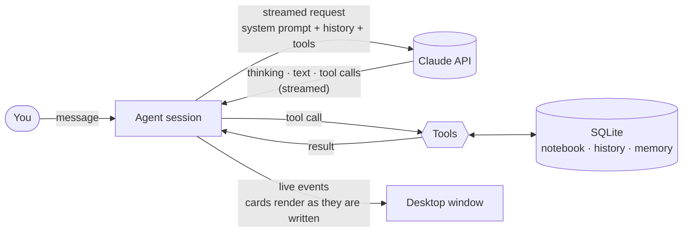

# Sentence Agent · 地道句子本

**A macOS desktop agent that helps Chinese speakers say things the way native English speakers do, built on the Claude API.**

[中文说明](README.zh-CN.md)

Type any sentence, in Chinese or English. The agent works out what you need: natural English for something you want to say, a breakdown of an English sentence you don't quite get, or a check of English you wrote yourself. The answer comes back as a rich card, and **every sentence is saved automatically** into a bilingual notebook. You review it the way you'd review vocabulary: cover one side, flip one sentence at a time, and let spaced repetition decide what comes back when.

---

## What it does

| You send | The agent gives you |
|---|---|
| **A Chinese sentence**<br>这事儿我得再考虑考虑。 | 2–4 natural English versions in different registers (casual / neutral / formal), each with a note on when to use it; phrases worth keeping, with new example sentences; common Chinglish renderings to avoid, and why. |
| **An English sentence you want to understand**<br>*I'd rather not get into it right now.* | A natural Chinese translation; the sentence split into color-coded parts (subject, verb, object, complements, adverbials, clauses…); the sentence skeleton and pattern; what it really means (tone, subtext, when people say it); grammar points with examples. |
| **English you wrote yourself**<br>*I very like this movie, it make me cry. Is this right?* | A verdict (natural / understandable but not idiomatic / incorrect), a word-level diff of the minimal correction, an issue-by-issue explanation (grammar, word choice, collocation, tone…), and how a native speaker would actually put it. |
| **Anything else** | Direct answers and follow-ups: "What's the difference between *hang out* and *hang around*?", "Can I use that in a work email?", "What was that sentence about 'considering' I asked last week?" |

And around the conversation:

- **Notebook.** Chinese on the left, English on the right. Hide either column and tap a single sentence to reveal it. Search, filter (due / still shaky / learned), shuffle, edit, or export to CSV.
- **Flashcard review.** Practise Chinese → English or English → Chinese. "Got it" pushes a card out 1, 3, 7, 16, then 35 days; "Not yet" brings it back later in the same round and again tomorrow.
- **Long-term memory.** When the same kind of mistake keeps showing up (articles, tense, *very + verb*…), the agent records it as a weak point and takes it into account in future conversations.
- **Native voice.** Any English sentence can be read aloud with the macOS system voice.
- **Cost awareness.** Settings shows an estimated spend for today and this month. The app also suggests starting a new conversation once the current one gets long enough to be expensive.

## How the agent works



**The loop.** Each turn runs through the tool runner in the official Anthropic Python SDK (`client.beta.messages.tool_runner`, streaming). The runner calls Claude, executes whichever tools Claude asks for, feeds the results back, and repeats until Claude is done, with a cap of 10 tool rounds per turn. Defaults are **Claude Opus 5** with adaptive thinking (summarized thinking is shown in a collapsible block) and effort set to *medium*. Model and effort can both be changed in Settings.

**Claude decides what to do.** Nothing in the app routes your input by keyword. Claude reads the message and picks a tool:

| Tool | When Claude calls it | What happens |
|---|---|---|
| `save_translation` | You gave a Chinese sentence to express in English | Saves the card; the notebook keeps the recommended version |
| `save_analysis` | You gave an English sentence to understand | Saves the translation and structural breakdown |
| `save_correction` | You gave your own English to check | Saves the correction; the notebook keeps the natural version |
| `search_notebook` | You ask about something you looked up before | Keyword search over your notebook |
| `remember_weak_point` | A mistake keeps recurring | Adds or increments a weak point in long-term memory |
| `get_study_overview` | You ask about your progress | Notebook totals, cards due, recorded weak points |

**Tool inputs are the UI.** The three `save_*` tools use typed Pydantic schemas, and their arguments *are* the card content. The tools run with `eager_input_streaming`, so the UI parses the partial JSON as it arrives and draws the card while Claude is still writing it. When the tool executes, the input is validated and the sentence lands in the notebook. If an input fails validation, the error goes back to Claude so it can retry.

**Conversations survive restarts.** The complete API history, including thinking blocks with their signatures and every `tool_use` / `tool_result` pair, is stored append-only in SQLite and replayed verbatim on the next request. If a turn is stopped or the app is closed mid-tool-call, the dangling call is closed with an error result before the next request, so the history is always valid.

**Memory without cache misses.** The system prompt has two blocks. The first is a fixed instruction block with a cache breakpoint, shared by every conversation. The second is a learner profile (today's date, notebook size, recorded weak points) that is snapshotted when a conversation starts and stays fixed for that conversation. Together with automatic caching of the conversation tail, most of each request is served from the prompt cache.

**Resilience.** Opus 5 and Fable 5.1 requests enable server-side refusal fallbacks (`fallbacks: "default"`). API errors (bad key, rate limits, network, model not found) are mapped to plain-language messages with a shortcut to Settings where that helps.

## Architecture

```
Desktop window  (pywebview, native WebKit)
  └─ UI: src/sentence_agent/static        plain ES modules, no build step
        │  HTTP + server-sent events; bound to 127.0.0.1, per-launch access token
Local server  (FastAPI)                   src/sentence_agent/server.py
  ├─ agent/session.py      streaming tool-runner loop, history mirroring, error mapping
  ├─ agent/tools.py        the six tools and their schemas
  ├─ agent/prompts.py      system prompt + learner profile
  ├─ agent/transcript.py   stored API history → chat view
  ├─ store.py              SQLite: conversations, messages, cards, reviews, memory, usage
  ├─ srs.py                spaced-repetition scheduling
  └─ credentials.py        API key in the macOS Keychain
```

## Getting started

**Requirements:** macOS 12 or later, Python 3.10+, and an [Anthropic API key](https://console.anthropic.com). API usage is billed separately from Claude.ai subscriptions; looking up one sentence typically costs a few cents.

```bash
git clone git@github.com:wangshen-tech/sentence_agent.git
cd sentence_agent
python3 -m venv .venv
.venv/bin/pip install -e ".[dev]"

.venv/bin/python -m sentence_agent     # run from source in a native window
scripts/build_app.sh                   # or build dist/地道句子本.app
```

On first launch, open **Settings** and paste your API key. It is checked against the API, then stored in the macOS Keychain and never written to disk in plain text. (The `ANTHROPIC_API_KEY` environment variable also works.)

Keyboard: <kbd>Return</kbd> send · <kbd>Shift</kbd>+<kbd>Return</kbd> new line · <kbd>⌘</kbd><kbd>N</kbd> new conversation · in review, <kbd>Space</kbd> flip, <kbd>1</kbd> not yet, <kbd>2</kbd> got it.

## Development

```bash
.venv/bin/python -m pytest              # offline tests, no API key needed
.venv/bin/python scripts/dev_server.py  # scripted fake Claude + demo data → http://127.0.0.1:8765/#t=dev
```

The agent tests don't mock the agent. They replace the HTTP layer with a scripted Messages API that replays real server-sent event streams (thinking, streamed tool input, tool calls, refusals, auth errors), so the **real SDK tool runner, real tools and a real SQLite database** run end to end. The tests cover the request shape (caching, thinking, fallbacks, eager streaming), history round-tripping with thinking signatures, invalid tool input, refusals, and repair of interrupted tool calls.

## Privacy

Your notebook, conversations and memory live only on your Mac, in `~/Library/Application Support/SentenceAgent/`. The API key lives in the Keychain. The only network traffic is to the Anthropic API. The local server listens on `127.0.0.1` only and rejects any request that doesn't carry the token generated at launch.
